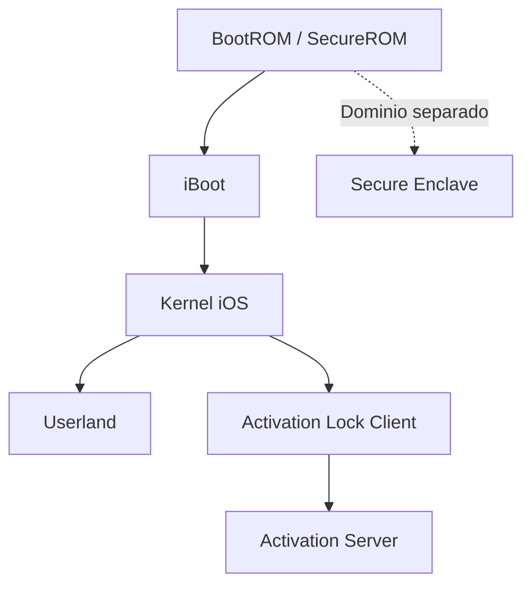

# iOS Security Memory Safety Demo


Demostracion academica escrita en C sobre conceptos de seguridad relacionados con la cadena de arranque de iOS, la vulnerabilidad checkm8, el modelo de confianza BootROM -> iBoot -> Kernel y los limites entre jailbreak, Secure Enclave y Activation Lock.

Este proyecto es exclusivamente educativo. No reproduce checkm8, no interactua con dispositivos Apple reales, no implementa un bypass de Activation Lock y no contiene codigo operativo de explotacion contra iOS.

## Responsible security research / educational only

Este repositorio debe entenderse como una practica academica de seguridad defensiva y analisis conceptual.

Uso previsto:

- explicar errores de memoria de tipo use-after-free;
- mostrar por que una vulnerabilidad temprana en la cadena de arranque es grave;
- diferenciar compromiso local, Secure Enclave, keybag y Activation Lock;
- practicar compilacion, sanitizers, tests y organizacion modular de un proyecto en C.

Uso no previsto:

- atacar dispositivos reales;
- evadir Activation Lock;
- acceder a datos de terceros;
- construir herramientas de jailbreak operativas;
- saltarse mecanismos antirrobo o de autenticacion;
- documentar offsets, payloads, paquetes USB, cadenas ROP o procedimientos reales de explotacion.

## Contexto

checkm8 es el nombre de una vulnerabilidad asociada a determinados SoCs de Apple, desde A5 hasta A11, relacionada con la BootROM/SecureROM. Su relevancia tecnica se debe a que afecta a una etapa muy temprana de la cadena de arranque.

En un modelo simplificado, la cadena de arranque segura puede representarse asi:

```text
BootROM -> iBoot -> Kernel -> Userland
   \
    \-> Secure Enclave separado
```

El siguiente diagrama Mermaid muestra la misma idea de forma visual:



La BootROM actua como raiz de confianza. Si se compromete esta primera etapa, se rompe la confianza sobre las etapas posteriores, ya que el atacante puede alterar que componente se carga despues. Al estar la BootROM grabada en ROM dentro del SoC, un fallo en esa zona no puede corregirse completamente mediante una simple actualizacion de software en dispositivos ya fabricados.

## Lenguaje utilizado

El proyecto esta desarrollado en lenguaje C.

Se ha elegido C porque permite representar de forma directa conceptos de bajo nivel como:

- reserva y liberacion manual de memoria con `malloc` y `free`;
- punteros colgantes;
- estructuras en memoria;
- punteros a funcion;
- secuestro conceptual del flujo de ejecucion;
- errores de tipo use-after-free;
- deteccion de errores mediante AddressSanitizer.

## Estructura del proyecto

```text
.
├── include/
│   └── demo.h
├── src/
│   ├── main.c
│   ├── uaf_demo.c
│   ├── bootchain_model.c
│   ├── activation_lock_model.c
│   └── ios_internals_model.c
├── tests/
│   └── unit_tests.c
├── .github/
│   └── workflows/
│       └── build.yml
├── .gitignore
├── Makefile
├── LICENSE
└── README.md
```

### Modulos principales

| Archivo | Responsabilidad |
| --- | --- |
| `include/demo.h` | Tipos compartidos, estructuras publicas y prototipos del proyecto |
| `src/main.c` | Punto de entrada y orquestacion de la demo |
| `src/uaf_demo.c` | Demostracion use-after-free, version corregida y ruta ASan |
| `src/bootchain_model.c` | Modelo BootROM -> iBoot -> Kernel y alcance del compromiso |
| `src/activation_lock_model.c` | Modelo conceptual y funcion testeable de Activation Lock |
| `src/ios_internals_model.c` | Modelo conceptual de iOS internals: BootROM, DFU, iBoot, kernelcache, SEP, keybag y activacion remota |
| `tests/unit_tests.c` | Tests reales con `assert` sobre boot chain, DFURequest, Activation Lock e iOS internals conceptuales |

## Modelo conceptual de iOS internals

El modulo `src/ios_internals_model.c` anade una capa academica que modela dominios internos de iOS sin implementar detalles operativos reales.

El modelo representa:

- `BootROM / SecureROM`: raiz inicial de confianza del procesador principal;
- `DFU`: superficie temprana de recuperacion antes del sistema operativo;
- `iBoot`: etapa que valida y prepara la carga del kernel;
- `kernelcache`: nucleo del sistema iOS;
- `Userland`: procesos y servicios por encima del kernel;
- `Secure Enclave`: dominio separado para operaciones sensibles;
- `Keybag`: modelo conceptual de proteccion de claves ligada al usuario;
- `Activation Lock`: autorizacion remota ligada a identidad y servidor.

La finalidad es reforzar una idea importante: una vulnerabilidad local grave en el procesador principal no implica automaticamente control del Secure Enclave, extraccion de claves protegidas, descifrado de datos de usuario o autorizacion remota de Activation Lock.

El modelo incluye funciones testeables como:

```c
IosInternalsModel crearModeloIosInternalsAcademico(void);
IosTrustDecision validarCadenaArranqueIosModelo(const IosInternalsModel *model);
IosTrustDecision compromisoLocalPermiteExtraerClavesSepModelo(
    const IosInternalsModel *model,
    const Dispositivo *disp
);
IosTrustDecision compromisoLocalPermiteAutorizarActivationLockModelo(
    const IosInternalsModel *model,
    const Dispositivo *disp
);
```

Estas funciones son deliberadamente conceptuales. No describen offsets, formatos internos reales, blobs firmados, trafico USB, payloads, cadenas ROP, memoria de BootROM ni procedimientos practicos de explotacion.

## API de Activation Lock

El modelo de Activation Lock usa estructuras publicas para representar mejor una validacion cliente-servidor.

```c
typedef enum {
    ACTIVATION_DENIED = 0,
    ACTIVATION_ALLOWED = 1
} ActivationResult;

typedef struct {
    char ecid[ACTIVATION_ECID_SIZE];
    char apple_id_propietario[ACTIVATION_APPLE_ID_SIZE];
    int  activation_lock_activo;
} ActivationRecord;

typedef struct {
    char ecid[ACTIVATION_ECID_SIZE];
    char apple_id_presentado[ACTIVATION_APPLE_ID_SIZE];
    int  ticket_firmado_por_apple;
} ActivationRequest;

ActivationResult validarActivationLockModelo(
    const ActivationRecord *record,
    const ActivationRequest *request
);
```

La funcion `validarActivationLockModelo` deniega por defecto entradas no validas. En concreto, rechaza:

- punteros `NULL`;
- campos de texto vacios;
- buffers sin terminador `\0`, que representan entradas demasiado largas o mal formadas;
- ECID que no coincide con el registro;
- Apple ID incorrecto;
- ausencia de ticket valido cuando Activation Lock esta activo.

Esta API evita una firma excesivamente larga con muchos parametros sueltos y hace que el codigo sea mas legible, testeable y parecido a una validacion remota real.

## Robustez defensiva

El proyecto incluye guardas defensivas para evitar fallos innecesarios en funciones publicas que reciben punteros.

Ejemplos:

- `imprimirEstado(NULL)` imprime un estado no disponible en lugar de desreferenciar un puntero nulo;
- `propagarCompromisoModelo(NULL)` retorna sin modificar nada;
- `capacidadesDelAtacante(NULL)` informa de que no puede evaluar el alcance;
- los estados `Estado` se convierten a texto mediante `estadoComoTexto`, que devuelve `DESCONOCIDO` si recibe un valor fuera del enum esperado.

Esto evita indexar arrays con enums no validados y mejora el comportamiento del programa ante estados corruptos o mal formados.

## Makefile

El proyecto incluye estos objetivos:

```bash
make
make run
make strict
make test
make asan
make ubsan
make clean
```

### Compilar

```bash
make
```

Equivale a compilar el proyecto modular usando `gcc`:

```bash
gcc -std=c99 -O0 -Wall -Wextra -Iinclude src/main.c src/uaf_demo.c src/bootchain_model.c src/activation_lock_model.c src/ios_internals_model.c -o demo
```

### Ejecutar

```bash
make run
```

### Compilacion estricta

```bash
make strict
```

Compila con flags mas exigentes, incluyendo `-Wpedantic`, `-Wshadow`, `-Wconversion` y `-Werror`. La advertencia de `use-after-free` no se convierte en error solo cuando el compilador es GCC, porque el proyecto contiene una ruta educativa intencional para demostrar ese fallo. Con Clang no se inyecta esa excepcion para evitar errores por flags desconocidas.

### Ejecutar unit tests

```bash
make test
```

El test compila `tests/unit_tests.c` junto con los modulos del proyecto, excepto `src/main.c`, y valida con `assert` que:

- el estado inicial del dispositivo es coherente;
- los helpers de estado rechazan enums invalidos;
- el compromiso de BootROM propaga correctamente hacia iBoot y Kernel;
- Secure Enclave y Activation Lock permanecen intactos tras el compromiso local;
- la estructura `DFURequest` mantiene los valores esperados;
- Activation Lock rechaza punteros `NULL`;
- Activation Lock rechaza campos vacios;
- Activation Lock rechaza campos demasiado largos/no terminados;
- Activation Lock rechaza identidad incorrecta o ticket ausente;
- Activation Lock acepta al propietario con Apple ID correcto y ticket valido;
- Activation Lock permite activacion cuando el bloqueo no esta activo;
- el modelo de iOS internals mantiene separados SEP, keybag y Activation Lock frente a un compromiso local del procesador principal.

### Ejecutar con AddressSanitizer

```bash
make asan
```

El objetivo `asan` compila usando AddressSanitizer y ejecuta una ruta educativa especifica:

```bash
gcc -std=c99 -O0 -Wall -Wextra -fsanitize=address -Iinclude src/main.c src/uaf_demo.c src/bootchain_model.c src/activation_lock_model.c src/ios_internals_model.c -o demo_asan
./demo_asan --asan-trigger
```

A diferencia de una ejecucion meramente informativa, `make asan` ahora verifica que ASan detecta realmente el bug esperado. Para ello:

1. ejecuta la ruta `--asan-trigger`;
2. guarda la salida en `asan_output.log`;
3. busca el patron `AddressSanitizer:.*heap-use-after-free`;
4. devuelve exito solo si ese patron aparece;
5. falla si ASan no detecta el use-after-free esperado.

### Ejecutar con UndefinedBehaviorSanitizer

```bash
make ubsan
```

Compila el proyecto con `-fsanitize=undefined` y ejecuta la demo para detectar comportamiento indefinido no relacionado directamente con ASan.

### Limpiar binarios generados

```bash
make clean
```

Elimina los binarios generados por la compilacion normal, compilacion estricta, AddressSanitizer, UndefinedBehaviorSanitizer, tests y el log temporal de ASan.

## Que demuestra el codigo

La demo muestra que un fallo de tipo use-after-free puede permitir que un programa vuelva a usar memoria ya liberada. Si esa memoria es reutilizada con datos controlados, el flujo de ejecucion puede desviarse.

En el ejemplo, una estructura `DFURequest` contiene un puntero a funcion llamado `handler`. Primero apunta a una funcion legitima. Despues, la estructura se libera, pero el puntero antiguo se sigue usando. Si el bloque de memoria se reutiliza con una estructura controlada, el campo `handler` puede apuntar a otra funcion.

Esto representa de forma didactica como una vulnerabilidad de memoria puede afectar al flujo de ejecucion. No representa el funcionamiento real de checkm8 ni una explotacion realista de iOS. Es una abstraccion segura para relacionar errores de memoria, cadena de confianza y dominios de seguridad.

## Relacion conceptual con checkm8

La relacion con checkm8 es conceptual:

- checkm8 afecta a una etapa temprana del arranque;
- el fallo se asocia al entorno USB DFU de la BootROM;
- al estar en ROM, no puede parchearse completamente por software en chips ya fabricados;
- comprometer la BootROM puede alterar la cadena de arranque local;
- este compromiso puede facilitar jailbreaks o ejecucion de codigo no firmado;
- no equivale automaticamente a descifrar datos del usuario, controlar SEP ni retirar Activation Lock.

## Secure Enclave, keybag y Activation Lock

El codigo modela Secure Enclave, keybag y Activation Lock como dominios separados.

La idea central es que comprometer el procesador principal no implica automaticamente:

- obtener el control del Secure Enclave;
- extraer claves protegidas;
- descifrar datos protegidos por secretos del usuario;
- generar una autorizacion remota valida de Activation Lock.

Activation Lock se representa como una validacion que depende de un servidor remoto y de la identidad del propietario. El codigo diferencia entre modificar el estado local del dispositivo, ocultar una pantalla o parchear una comprobacion local, y obtener una autorizacion remota legitima.

## Catalogo de vulnerabilidades analizadas

| Vector | Capa atacada | Impacto conceptual |
| --- | --- | --- |
| Parche local de interfaz | Sistema local | Puede ocultar una pantalla, pero no elimina el vinculo remoto |
| Modificacion de servicios locales | Kernel / servicios locales | Puede alterar comportamiento local, pero no genera activacion valida |
| Suplantacion de servidor | Comunicacion cliente-servidor | Debe fallar si se validan certificados y respuestas firmadas |
| Replay de ticket | Protocolo de activacion | Debe fallar si el ticket esta ligado a sesion, ECID y nonces |
| Robo de credenciales del propietario | Cuenta del usuario | Puede permitir retirada legitima, pero no es consecuencia directa de checkm8 |
| Fallo logico en servidor | Infraestructura remota | Seria critico, pero no seria un fallo local del dispositivo |
| Ingenieria social | Usuario propietario | Ataque humano, no vulnerabilidad tecnica de BootROM |

## Por que el comportamiento del heap puede variar

El resultado de una demostracion use-after-free basada en reutilizacion de memoria no siempre es identico en todos los entornos.

Algunos factores que influyen:

- el allocator utilizado por la libc, por ejemplo glibc `malloc`, jemalloc, tcmalloc o el heap de Windows;
- caches internas del allocator, como `tcache` en glibc;
- arquitectura del procesador y alineacion de memoria;
- nivel de optimizacion del compilador;
- flags de seguridad y depuracion;
- AddressSanitizer u otros instrumentadores;
- estado previo del heap antes de la asignacion;
- tamano exacto de la estructura y clase de tamaño usada por el allocator.

En muchas implementaciones modernas, un bloque liberado puede reutilizarse rapidamente si se solicita otra reserva del mismo tamaño. Sin embargo, eso no es una garantia portable del lenguaje C. Es un comportamiento dependiente de la implementacion, por eso la demo imprime la direccion del bloque original y la direccion del bloque reutilizado.

La version con AddressSanitizer es mas apropiada para demostrar el error de memoria de forma diagnostica, porque ASan instrumenta las asignaciones y marca regiones liberadas como invalidas. Por eso puede detectar explicitamente el acceso despues de `free`.

## GitHub Actions

El repositorio incluye un workflow en:

```text
.github/workflows/build.yml
```

El workflow ejecuta la misma bateria de comprobaciones con GCC y Clang mediante una matriz de compiladores:

```bash
make
make strict
make run
make test
make asan
make ubsan
make clean
```

Esto permite comprobar automaticamente que el proyecto compila con mas de un compilador, que los unit tests pasan y que las rutas educativas de sanitizers funcionan como se espera.

## Limitaciones

Este proyecto tiene las siguientes limitaciones intencionadas:

- no interactua con dispositivos Apple reales;
- no usa USB ni modo DFU real;
- no reproduce checkm8;
- no contiene shellcode;
- no implementa cadenas ROP;
- no evade Activation Lock;
- no accede a datos reales del usuario;
- no modifica ningun sistema operativo;
- no contiene informacion operacional para explotar dispositivos Apple.

La finalidad es exclusivamente academica y conceptual.

## Licencia

Este proyecto se distribuye bajo licencia MIT. Consulta el archivo `LICENSE` para mas informacion.

## Conclusiones

El proyecto demuestra que una vulnerabilidad en una capa temprana puede tener un impacto muy alto porque rompe la cadena de confianza desde la raiz. Sin embargo, tambien muestra que un sistema moderno separa responsabilidades entre distintos dominios de seguridad.

Por tanto, comprometer BootROM, iBoot o el kernel local no significa necesariamente comprometer Secure Enclave, descifrar datos protegidos o retirar Activation Lock de forma legitima.

El analisis de seguridad debe distinguir entre:

- fallos locales de memoria;
- fallos de cadena de arranque;
- fallos criptograficos;
- fallos de servidor;
- robo de credenciales;
- ingenieria social.

Esa separacion es clave para entender correctamente el alcance real de vulnerabilidades como checkm8.
